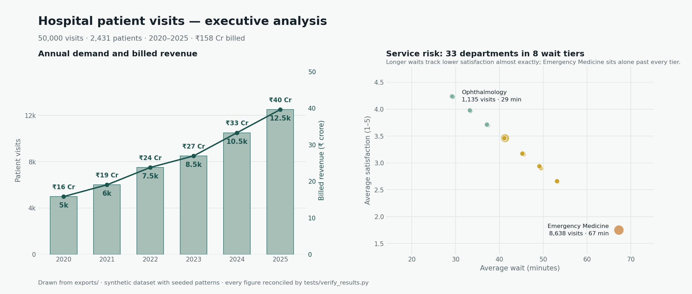
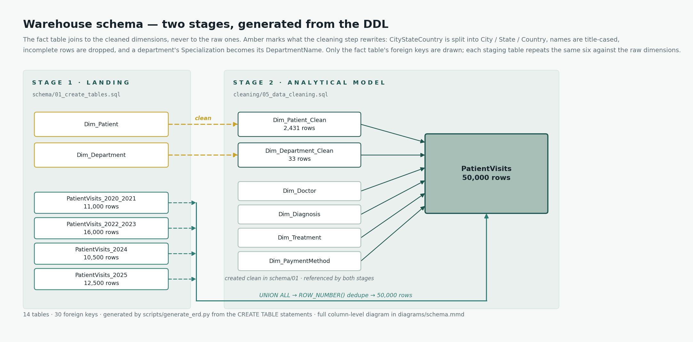
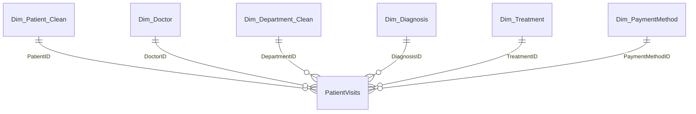

# Hospital Patient Visits — a T-SQL warehouse you can poke at

A Microsoft SQL Server project that lands 50,000 hospital visits across four
year-partitioned source tables, cleans them into a validated star schema, and
answers twelve analytical questions about demand, billed revenue, wait times,
patient satisfaction and treatment activity. Every published number is
cross-checked by a second, independent implementation before it is allowed into
this README.

**[Open the live dashboard →](https://agnishant14.github.io/hospital-patient-analytics-sql/)**
Filter 50,000 visits by year, day type and department in the browser; no SQL
Server needed. Same numbers as the SQL, and a test proves it.
*(Replace `GITHUB-USERNAME` above after enabling Pages — see
[Web dashboard](#web-dashboard).)*



## The data is synthetic, and that is the interesting part

`data/04_generate_visits.sql` writes the fact rows in T-SQL from a fixed
specification: Emergency Medicine is given the longest base wait, satisfaction
is a declared step function of wait time, annual volume grows on fixed year
boundaries, weekend visits carry an eight-minute penalty, and 486 of the 2,431
patients are held back as one-time visitors.

That specification is a *test fixture*. Because the expected answer to every
question is known in advance, the analysis layer can be checked rather than
merely eyeballed — which is the whole reason this project is built the way it
is. `tests/oracle.py` is a second implementation of the same written
specification in pure Python. It reads the dimension data straight out of the
committed `INSERT` statements, recomputes all 50,000 facts and every published
aggregate from scratch, and never touches SQL Server.
`tests/verify_results.py` then diffs the oracle against the CSVs the T-SQL
exports. If the two disagree by a single paisa, the build fails.

Two independent implementations agreeing on ~1,680 aggregate values is the
actual evidence that the SQL is correct. The duplication is deliberate; it is
the point. What this project does *not* claim is any insight into real
hospitals — see [Limitations](#limitations).

## Findings

Across 50,000 visits and 2,431 patients from 2020 to 2025, the warehouse bills
₹158.4 crore at an average of ₹31,689.58 per visit, with a mean wait of 45.69
minutes and mean satisfaction of 3.16 out of 5.

Annual visits grew from 5,000 in 2020 to 12,500 in 2025 — 2.5× — while billed
revenue grew 2.51×, from ₹15.81 Cr to ₹39.62 Cr. Emergency Medicine is the
department that dominates both: 8,638 visits,
22.34% of all billed revenue, and the longest average wait in the hospital at
67.27 minutes. Cardiology follows with 6,135 visits and ₹141.02 million billed.
Weekdays carry 35,717 visits (71.43%), and 80.01% of visits come from patients
who have been seen before.

Wait time and satisfaction move together almost mechanically, which is what the
generator was told to do. The more useful observation is the *shape*: the 33
departments do not spread evenly across the wait axis but cluster into eight
tight tiers, with waits inside a tier differing by well under a minute.
Emergency Medicine sits alone past every tier. On real data that clustering
would be a finding worth chasing; here it is the seeded structure showing
through, and the scatter in the chart above is drawn to make it visible rather
than to hide it behind large markers.

Full derivations are in [results/key_findings.md](results/key_findings.md).

## Data model

Fourteen tables in two stages. Stage one lands what the source system provides:
six raw dimensions and four year-partitioned visit tables. Stage two produces
what the analysis reads: two cleaned dimensions and one consolidated fact table.



The distinction matters, and an earlier hand-drawn version of that diagram got
it wrong — it showed `PatientVisits` joined to the raw `Dim_Patient` and
`Dim_Department`, which is the *staging* tables' shape, and omitted the staging
tables entirely. A reader would have come away believing the cleaning step did
not exist. Both diagrams are now generated from the `CREATE TABLE` statements by
`scripts/generate_erd.py`, and `tests/verify_sql_layout.py` fails if the
committed files stop matching the DDL.

What the twelve analytical queries actually join:



All 14 tables with columns, types and keys are in
[diagrams/schema.mmd](diagrams/schema.mmd).

## Pipeline

`run_all.sql` runs nine steps in order and stops on the first error
(`:ON ERROR EXIT`), so a broken build never produces half-loaded analysis.

| Step | File | What it does |
| --- | --- | --- |
| 01 | `schema/01_create_tables.sql` | Raw dimensions and four staging fact tables |
| 02–03 | `data/02`, `data/03` | Patients, doctors and reference dimensions |
| 04 | `data/04_generate_visits.sql` | Generates 50,000 visits from the specification |
| 05 | `cleaning/05_data_cleaning.sql` | Cleans, consolidates and constrains |
| 06 | `schema/06_create_indexes.sql` | Four nonclustered analytical indexes |
| 07 | `validation/08_data_quality_checks.sql` | 11 fail-fast checks |
| 08 | `analysis/07_business_analysis.sql` | The twelve published queries |
| 09 | `analysis/09_index_performance.sql` | Benchmarks step 06 against itself |

Step 05 is where the work is. It splits the single `CityStateCountry` column
into `City`, `State` and `Country` with `PARSENAME`, title-cases names, drops
patient and department records too incomplete to use, promotes a department's
`Specialization` to its `DepartmentName`, combines the four staging tables with
`UNION ALL`, deduplicates on `VisitID` with `ROW_NUMBER()`, and enforces
referential, date, monetary, satisfaction and wait-time constraints on the way
in.

It also resolves city spellings through `dbo.Ref_CityAlias`, a lookup table
rather than a hardcoded `CASE`. That choice is what made the next section
possible.

### One defect, and the check that finds the next one

`Chennnai` sat next to `Chennai` in this dataset for as long as the project
existed. No constraint could catch it: both are valid strings, both pass every
range and referential check, and the only symptom is a distinct count one too
high and a `GROUP BY City` quietly split in two.

Correcting the spelling is a one-line fix and worth almost nothing. So
`validation/08` now asserts something stronger: no two city spellings in the
cleaned dimension may share a `SOUNDEX` code. `SOUNDEX` collapses doubled
letters and vowels, so `Chennai` and `Chennnai` both reduce to `C500`. Run
against the dimension as it stood before the fix, the rule was exact: 38
spellings, 37 codes, one collision, and that collision was the real defect —
zero false positives on the other 36 cities. The dimension now holds 37
spellings and 37 codes.

It is still a heuristic, and the code says so: if it ever fires on two
genuinely different cities, the fix is to exclude that pair by name, not to
delete the check and not to map one real city onto another. Adding a variant is
an `INSERT` into `Ref_CityAlias`, not an edit to transformation logic that is
already tested.

## How correctness is established

Five verifiers, all runnable with no database and no third-party packages
except `matplotlib` for the chart. Each one exists because a specific class of
mistake was going undetected.

```bash
python3 tests/verify_results.py       # SQL exports vs. the independent oracle
python3 tests/verify_sql_layout.py    # invariants between the .sql files
python3 tests/verify_powerbi.py       # the Power BI kit vs. the exports
python3 tests/verify_dashboard.py     # the dashboard payload vs. the exports
node    tests/verify_dashboard_js.mjs # the dashboard's own JS, in a DOM stub
```

`verify_results.py` is the differential test described above: ~1,680 aggregate
values, computed twice by two independent implementations, compared exactly.
When it is run against oracle-generated exports it says so, loudly, rather than
reporting a pass it has not earned.

`verify_sql_layout.py` checks the invariants that hold *between* SQL files —
the ones that break silently because each file still looks correct alone. Every
`:r` include resolves from the repository root (sqlcmd resolves includes
against the working directory, not the including file, so one file using the
other convention works from one directory and fails from the next). The
benchmark drops exactly the four indexes step 06 creates and asserts the right
count on restore. Every column the benchmark references exists on the fact
table. Every query is wired into the driver and has an export, and no export is
orphaned. `run_all.sql`'s step labels are sequential and match how many files it
actually runs. The benchmark's phase names match the ones its report joins on —
a phase renamed in one place and not the other yields no error at all, just a
report that looks empty. And the schema diagram declares exactly the foreign
keys the DDL declares.

`verify_dashboard_js.mjs` is the one worth singling out. Checking that
`docs/data.js` contains the right numbers is easy; the interesting question is
whether the dashboard's own aggregation code, filters and percentile logic
reproduce the SQL. So it boots `docs/index.html` inside a minimal DOM stub,
runs the real functions, and reconciles the KPIs, all 33 departments, both wait
histograms, the payment mix, the age bands, all 72 months, the doctor
leaderboard row for row including ties, and every year, day-type and department
filter slice against the exports.

Each verifier has been mutation-tested: deliberate defects were introduced one
at a time to confirm the check fails, and fails with a message that names the
problem. A verifier nobody has tried to break is a verifier that might not
check anything.

## Do the indexes earn their keep?

`schema/06` claims its four indexes support "the portfolio's most common
analytical paths". That is an assertion, not a result, so
`analysis/09_index_performance.sql` measures it: eight workloads run with the
indexes present and again with only the clustered primary key, warmed up twice
and measured seven times each.

Logical reads are the headline metric because they are deterministic — the same
query over the same data touches the same number of 8 KB pages on a laptop and
on a production box. Elapsed time is reported too, but on a 50,000-row table
that fits in the buffer pool it is mostly scheduler noise, so the report takes
the *minimum* of seven runs rather than the mean: interference only ever adds
time. Two of the eight workloads are controls — a point lookup by `PatientID`,
which is what a nonclustered index is for, and an ungrouped aggregate over
every row, which no index can help — because without them there is no scale to
judge the middle of the table against.

[results/index_performance.md](results/index_performance.md) records predictions
made *before* the first run, and is explicit that the result tables are still
empty: nobody has run the harness against a real instance yet. Timings cannot
be recomputed from a specification the way results can.

## Power BI kit

[powerbi/](powerbi/) is a build kit, not a `.pbix`. Power BI Desktop is
Windows-only, and a binary file in a repository is something a reader has to
take on faith. The kit is a step-by-step build from the CSVs in `exports/`, with
40 DAX measures in [powerbi/measures.dax](powerbi/measures.dax) and a theme in
[powerbi/theme.json](powerbi/theme.json) sharing the exact colour ramp and wait
thresholds as the web dashboard, so a red band means the same thing in both.

`powerbi/README.md` includes a checklist of 22 figures to reconcile before
building any visual on the model, and it documents the places where DAX will
*not* match the SQL unless you are careful — `DATEDIFF(..., YEAR)` counts
calendar boundaries rather than birthdays, and a `DATEADD`-based age calculation
gets 2020-02-29 wrong, which is enough to move a published age-band percentage
from 20.00% to 20.29%. `tests/verify_powerbi.py` recomputes all 22 figures from
the exports and fails if the checklist has drifted.

## Web dashboard

[docs/index.html](docs/index.html) is a single self-contained page — no build
step, no framework, no CDN — that unpacks all 50,000 visits from a 722 KB
payload and filters them in the browser. It is what makes this project
inspectable in thirty seconds by someone who is never going to install SQL
Server.

To serve it from your own fork: **Settings → Pages → Source: Deploy from a
branch**, then choose branch `main` and folder `/docs`. The `docs/.nojekyll`
file is already committed so GitHub serves the directory as-is. Locally,
`python3 -m http.server -d docs` works.

Regenerate the payload and the charts after re-exporting:

```bash
python3 -m pip install -r requirements.txt
python3 scripts/build_dashboard_data.py
python3 scripts/generate_executive_summary.py
python3 scripts/generate_erd.py
```

## Run the pipeline

Requires Docker Desktop and an `amd64`-compatible SQL Server 2022 container.
From the repository root:

```bash
export HOSPITAL_SQL_PASSWORD='REPLACE_WITH_A_STRONG_PASSWORD'

docker run \
  --platform linux/amd64 \
  --name hospital-sql \
  -e ACCEPT_EULA=Y \
  -e MSSQL_SA_PASSWORD="$HOSPITAL_SQL_PASSWORD" \
  -p 1433:1433 \
  -v "$PWD":/project \
  -d \
  mcr.microsoft.com/mssql/server:2022-latest
```

Create the database once SQL Server has finished starting, then run the build:

```bash
docker exec hospital-sql /opt/mssql-tools18/bin/sqlcmd \
  -S localhost -U sa -P "$HOSPITAL_SQL_PASSWORD" -C \
  -Q "IF DB_ID('HospitalPatientAnalytics') IS NULL CREATE DATABASE HospitalPatientAnalytics;"

docker exec -w /project hospital-sql /opt/mssql-tools18/bin/sqlcmd \
  -S localhost -U sa -P "$HOSPITAL_SQL_PASSWORD" -C \
  -d HospitalPatientAnalytics -b -i run_all.sql
```

A successful build ends with:

```text
Consolidated visits    50000
All data-quality checks passed.
```

The build is rerunnable — step 01 drops and recreates this project's tables —
and no credential is committed anywhere; everything reads
`HOSPITAL_SQL_PASSWORD` from the environment. Use `docker start hospital-sql` if
the container already exists.

Then make the exports authoritative and re-verify:

```bash
./scripts/export_from_sqlserver.sh
python3 tests/verify_results.py
```

## Repository map

```text
run_all.sql                 nine steps, stops on first error
schema/                     raw tables (01), analytical indexes (06)
data/                       dimension inserts (02, 03), visit generator (04)
cleaning/                   clean, consolidate, constrain (05)
validation/                 11 fail-fast quality checks (08)
analysis/
  07_business_analysis.sql  driver for the twelve queries
  09_index_performance.sql  the index benchmark
  queries/                  q01–q12, one file each
  model/                    dimension and fact extracts for BI tools
exports/                    19 CSVs + PROVENANCE.txt
tests/                      the oracle and the five verifiers
docs/                       the live dashboard (GitHub Pages)
powerbi/                    build kit, 40 DAX measures, shared theme
scripts/                    exports, dashboard payload, chart, ERD
results/                    key findings, index benchmark, chart
diagrams/                   generated schema diagrams
```

## Limitations

The findings describe a deliberately patterned synthetic dataset, not a real
hospital; the correlations in it are there because the generator was told to put
them there, and no clinical or operational conclusion should be drawn from any
of them.

The CSVs in `exports/` are currently produced by the Python oracle rather than
by SQL Server — `exports/PROVENANCE.txt` states this, and `verify_results.py`
warns that comparing oracle output against oracle-generated exports proves very
little. Running the pipeline and re-exporting is what makes the comparison
meaningful. Similarly, `results/index_performance.md` has predictions but no
measurements yet.

The pipeline is batch-oriented and models no real-time ingestion, no slowly
changing dimensions and no incremental load. Billed revenue is stated in INR
and represents amounts billed, not revenue collected or recognised.

## License

[MIT](LICENSE).
