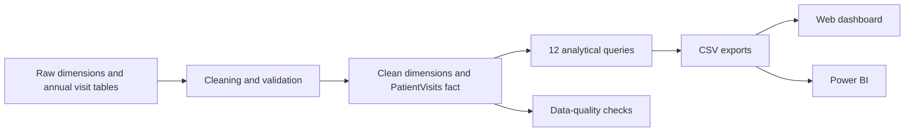

# Hospital Patient Analytics

A SQL Server analytics project that transforms 50,000 synthetic hospital visits into a validated star schema, business-ready insights, and an interactive dashboard.

**[View the live dashboard](https://agnishant14.github.io/hospital-patient-analytics-sql/)**


## Project snapshot

| Area | Scope |
| --- | --- |
| Dataset | 50,000 visits from 2020–2025 |
| Business entities | 2,431 patients, 200 doctors, 33 departments |
| Data model | Raw staging tables, cleaned dimensions, consolidated fact table |
| Analysis | 12 operational and financial SQL queries |
| Outputs | CSV exports, browser dashboard, Power BI build kit |
| Validation | SQL quality checks plus independent Python verification |

## What I built

- Designed a SQL Server warehouse with staging and analytical layers.
- Cleaned inconsistent names, gender values, locations, and incomplete records.
- Consolidated four annual visit tables into one constrained fact table.
- Added primary, foreign, range, and data-quality checks.
- Used CTEs, joins, window functions, ranking, year-over-year growth, and segmentation.
- Created analytical indexes and an index-performance benchmark.
- Built a filterable web dashboard and a 40-measure Power BI kit.
- Developed Python and JavaScript tests that reconcile published results.

## Key findings

| Metric | Result |
| --- | ---: |
| Total visits | 50,000 |
| Billed revenue | ₹158.4 crore |
| Average bill | ₹31,689.58 |
| Average wait | 45.69 minutes |
| Average satisfaction | 3.16 / 5 |
| Visit growth | 5,000 in 2020 to 12,500 in 2025 |
| Patients with repeat visits | 80.01% |

Emergency Medicine recorded the highest demand, the longest average wait at 67.27 minutes, and 22.34% of billed revenue. Detailed query results are available in [key findings](results/key_findings.md).

## Architecture



The analytical model joins `PatientVisits` to cleaned patient and department dimensions plus doctor, diagnosis, treatment, and payment dimensions.


## Repository structure

```text
schema/       tables and indexes
data/         dimension data and deterministic visit generator
cleaning/     transformation and consolidation logic
validation/   fail-fast data-quality checks
analysis/     business queries, BI extracts, and index benchmark
exports/      published datasets and query results
docs/         interactive dashboard
powerbi/      DAX measures and report theme
tests/        independent verification suite
```

## Validation

The Python oracle independently recreates the deterministic dataset and checks approximately 1,680 published values. Additional tests validate SQL file relationships, Power BI measures, dashboard data, and browser-side calculations.

```bash
python3 tests/verify_results.py
python3 tests/verify_sql_layout.py
python3 tests/verify_powerbi.py
python3 tests/verify_dashboard.py
node tests/verify_dashboard_js.mjs
```

## Run the SQL pipeline

Requirements: SQL Server 2022, `sqlcmd`, and an empty development database.

```bash
sqlcmd -S localhost -d HospitalPatientAnalytics -b -i run_all.sql
./scripts/export_from_sqlserver.sh
python3 tests/verify_results.py
```

`run_all.sql` executes schema creation, data loading, cleaning, indexing, validation, analysis, and the index benchmark in sequence.

## Tools demonstrated

`T-SQL` · `SQL Server` · `Star schema` · `ETL` · `Window functions` · `Data quality` · `Indexing` · `Python` · `JavaScript` · `Power BI` · `DAX`

## Limitations

- The dataset is synthetic and does not support real clinical conclusions.
- Current committed exports were produced by the Python oracle; running SQL Server and re-exporting provides an independent comparison.
- The index benchmark is implemented, but real SQL Server timing results have not yet been published.
